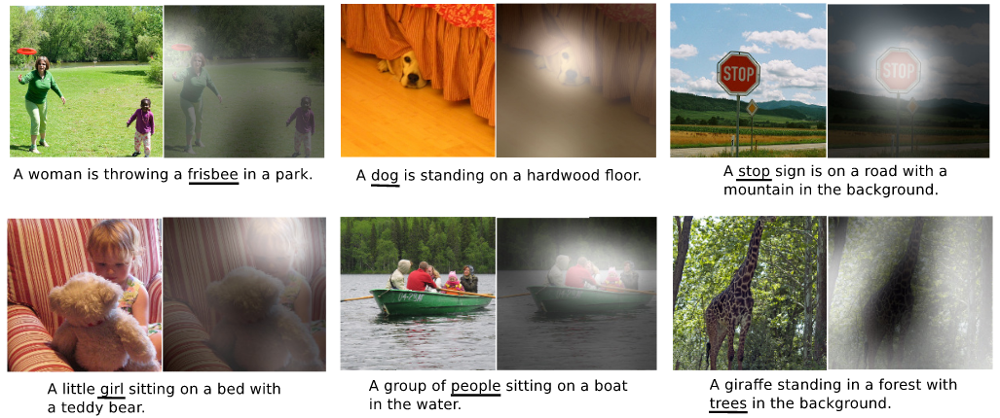
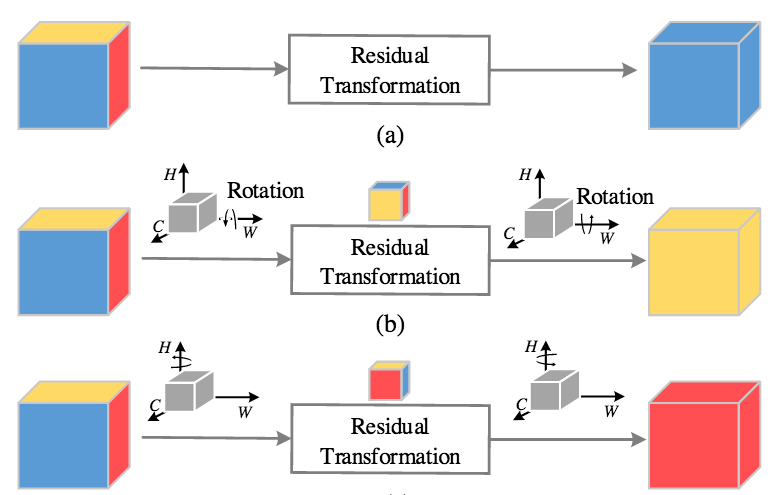
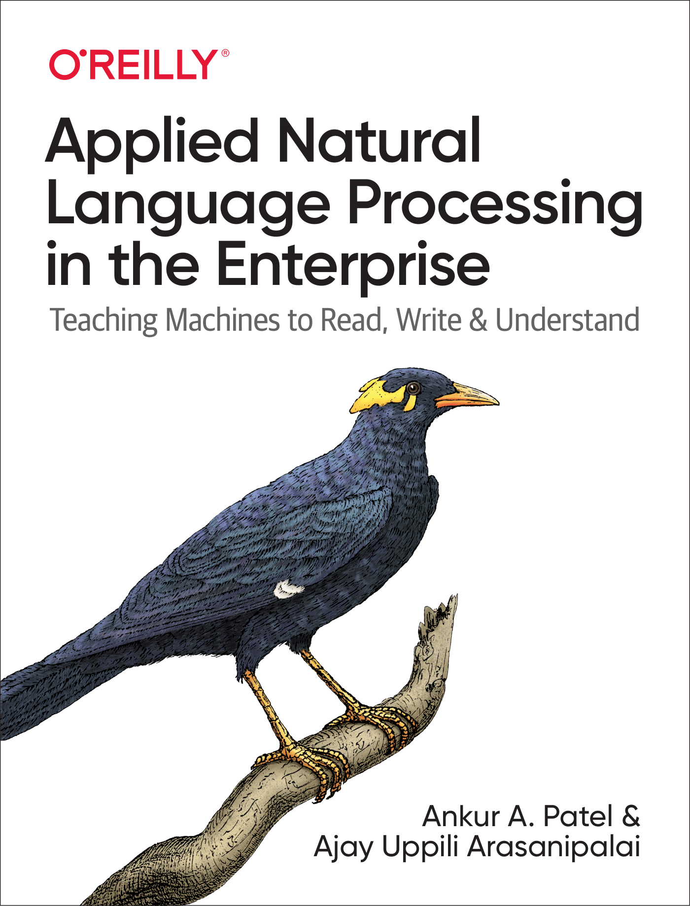

+++
title = "Pay Attention to Attention"
outputs = ["Reveal"]
+++

# Pay Attention to Attention!

---

<section>

## What _is_ an Attention Mechanism? 🤔

---

### Information Routing

---

### Global Features

---

### Interpretability

---

---

---

### Multi-Head Self-Attention

---

---

</section>

---

<section>

## Self-Attention vs. Attention 

---

Attention: input $\rightarrow$ output

---

Self-attention: input $\leftrightarrow$ input

--- 

In transformers, self-attention is applied _inside_ in the encoder

---

Attention is used _between_ the encoder and decoder

--- 

For each output, attention computes $n$ weights

---

For $n$ inputs, self-attention uses $n^2$ attention weights

</section>

---

<section>

## What About Compute? 🖥 

---

Self-attention is not exactly easy to run...

---

$ (1920 \times 1080)^2 = 4299816960000 $

---

# = 🤯

---

GPT-3 has 175 BILLION parameters

---

... and requires 22 GPUs ...

---

... to run inference!

</section>

---

<section>

## Solutions 🧪

---

### [Reformer](https://arxiv.org/abs/2001.04451.pdf)

---

### [Longformer](https://arxiv.org/abs/2004.05150)

---

### ... And Many More

[BigBird](https://arxiv.org/abs/2007.14062), [Linformer](https://arxiv.org/abs/2006.04768), [Lambda Networks](https://openreview.net/forum?id=xTJEN-ggl1b), etc.

</section>

---

<section>

## Triplet Attention

---

Goal: efficient attention mechanism for vision models

---

---

---

### Z-Pool

$$ (C, H, W) \rightarrow (2, H, W) $$

---

Composed of convolution and pooling

---

### Results

---

### GradCAM

</img>

---

### Resources

[Website](https://landskapeai.github.io/publication/triplet/) \
[Paper](https://arxiv.org/abs/2010.03045) \
[Code](https://github.com/LandskapeAI/triplet-attention)

</section>

---

### For More Attention & NLP

</img>

---

## Questions❓

---

Big thanks to Mr. Ganesan Narayanasamy, Dr. Sameer Shende, and the OpenPOWER foundation for providing the compute infrastructure neccesary to run our experiments.

# 👏

---

## Thank You For Joining!

---

## Image Credits

[jalammar.github.io](https://jalammar.github.io)